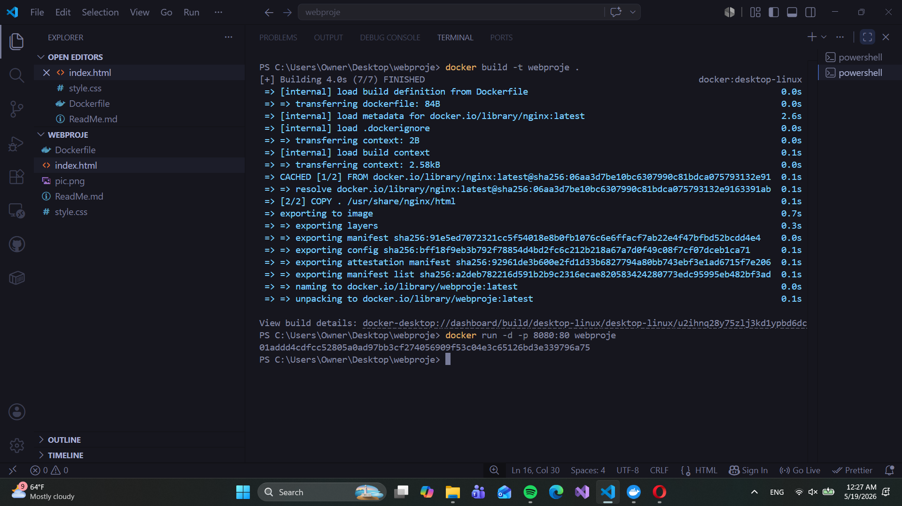
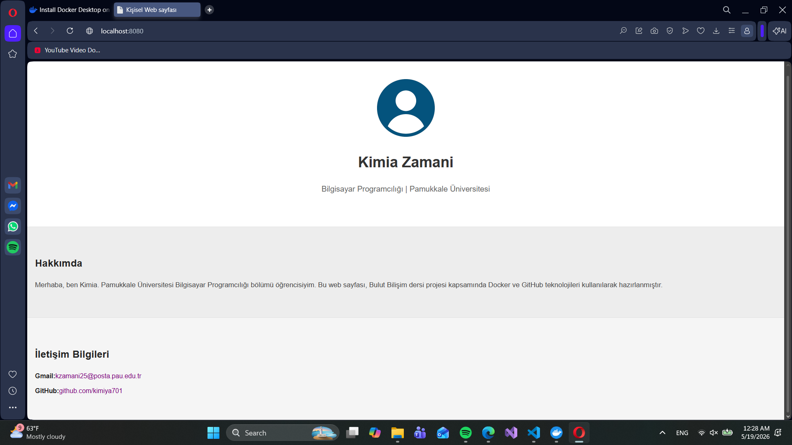

# Proje Adı: Kişisel Web Sayfası

Öğrenci Adı: Kimia Zamani

Kullanılan Teknolojiler: HTML, CSS, Docker, GitHub, GitHub Pages

## Projenin Kısa Açıklaması
Bu proje, Bulut Bilişim dersi kapsamında hazırlanmış basit bir kişisel web sayfasıdır. Proje Docker kullanılarak konteynerize edilmiş ve GitHub Pages üzerinden yayınlanmıştır.

## Docker Çalıştırma Komutları
Projeyi lokalde Docker ile çalıştırmak için aşağıdaki komutları kullanabilirsiniz:

1. Docker imajını oluşturmak: 
docker build -t webproje .

2. Konteyneri çalıştırmak: 
docker run -d -p 8080:80 webproje

